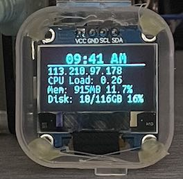

# Python script for LED 

## Preview



```bash
git clone git@github.com:sayuthisobri/pie-led.git
cd ./pie-led
```


## Install as service
> Might want to update working path on led-screen.service

```bash
# copy service file
cp ./led-screen.service /etc/systemd/system/led-screen.service

# reload service daemon
systemctl daemon-reload

# start service
systemctl start led-screen

# autostart service
systemctl enable led-screen
```

# Reference

- https://learn.adafruit.com/adafruits-raspberry-pi-lesson-4-gpio-setup/configuring-i2c
- https://medium.com/vacatronics/getting-started-with-raspberry-pi-i2c-and-ubuntu-server-eaa57ee0baf2